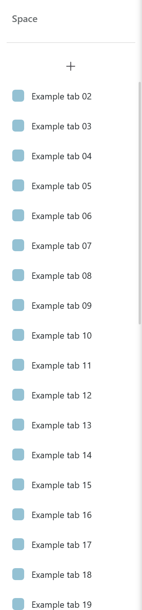

# Even Better New Tab Button

Zen's New Tab button normally scrolls away with a long vertical tab list. Even
Better New Tab Button keeps Zen's native `+` control visible while ordinary
tabs scroll, without replacing its command, tooltip, focus behavior, or theme
states.

> [!IMPORTANT]
> Sticky mode currently works only when Zen's built-in
> **Move New Tab button to top** setting is enabled. Bottom placement is not
> currently supported.

<p align="center">
  
</p>
<p align="center"><em>The New Tab control stays in place while the tab list scrolls; clicking it retains the optional press animation.</em></p>

## What it does

- Keeps Zen's native New Tab control visible above the scrolling ordinary-tab
  list.
- Preserves the button's hover, active, keyboard-focus, tooltip, and command
  behavior.
- Preserves the optional 90-degree plus rotation and pressed-scale animation.
- Works with expanded and collapsed sidebars when top placement is enabled.
- Keeps pinned tabs fixed above the button in sticky top mode.
- Restores upstream scrolling and the original inner button when sticky mode is
  disabled.
- Retains the upstream New Tab, tab, and folder corner-radius preferences.

## Installation

1. In Zen's settings, enable **Move New Tab button to top**.
2. Add this repository URL to Sine:

   ```text
   https://github.com/YiftahCooper/zen-even-better-new-tab-button
   ```

3. In the mod's Sine preferences, enable **Keep the New Tab button visible
   while tabs scroll**.
4. Restart Zen after installing or updating the mod so Sine loads the current
   stylesheet.

The animation and corner-radius options can be changed independently in the
same Sine preferences panel.

## Compatibility and known limitation

Version `1.0.2` was exercised through Sine's installed stylesheet path in Zen
`1.21.15b` (Firefox `154.0`) with Sine `2.3.3.0`. Top placement passed expanded
and collapsed sidebar checks, kept the button at the same measured vertical
position throughout tab scrolling, and retained the pointer-driven press and
plus-rotation animations. The mod has also been confirmed to function in a
normal browser profile with top placement enabled.

Sticky bottom placement is unsupported. When **Move New Tab button to top** is
disabled, ordinary tabs can extend into the New Tab row instead of reserving
space for it. This was reproduced in a clean Sine-only profile and independently
confirmed in a normal browser profile. Disable sticky mode or enable Zen's top
placement setting to avoid the overlap.

Zen's browser chrome is not a stable extension API, so compatibility with every
future Zen release cannot be guaranteed. See [VERIFICATION.md](VERIFICATION.md)
for the measured evidence and test boundaries.

## Upstream attribution

The CSS and first seven preferences before the isolated extension are preserved
byte-for-byte from upstream commit
`f1a23de04c7a63d14647b9626756ad58184bff19`.

- Upstream author/contact: `themaster_5209_` on Discord
- Development acknowledgement: CosmoCreeper
- Upstream Zen Discord thread:
  <https://discord.com/channels/1088172780480114748/1404796233591296081>

## Static tests

```powershell
python -m unittest discover -s tests -v
```

The tests bind the preserved upstream CSS and preferences, validate the mod
metadata and sticky preference, and constrain the extension to the selected Zen
controls. Static tests complement rather than replace live Zen and Sine testing.
