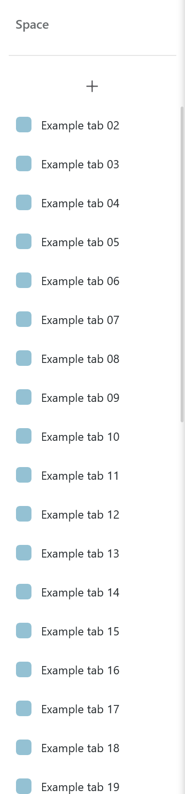

# Even Better New Tab Button

Zen's New Tab button normally scrolls away with a long vertical tab list. Even
Better New Tab Button keeps Zen's native `+` control visible while ordinary
tabs scroll, without replacing its command, tooltip, focus behavior, or theme
states.

> [!IMPORTANT]
> Sticky mode currently works only when Zen's built-in
> **Move New Tab button to top** setting is enabled. Bottom placement is not
> currently supported.
>
> Version 1.0.4 also requires Sine to load the included JavaScript module.
> For a repository install, see the JavaScript permission step below.

<p align="center">
  
</p>
<p align="center"><em>The New Tab control stays in place while the tab list scrolls; clicking it retains the optional press animation.</em></p>

## What it does

- Keeps Zen's native New Tab control visible above the scrolling ordinary-tab
  list.
- Preserves the button's hover, active, keyboard-focus, tooltip, and command
  behavior.
- Preserves the optional 90-degree plus rotation and pressed-scale animation.
- Works with expanded and collapsed sidebars when top placement is enabled.
- Keeps the pinned section above the button, with its own scrolling when tall
  pinned folders would otherwise crowd out ordinary tabs.
- Reserves a minimum ordinary-tab viewport of two native row pitches and
  reveals selected/focused tabs when navigating with the keyboard.
- Restores upstream scrolling and the original inner button when sticky mode is
  disabled.
- Retains the upstream New Tab, tab, and folder corner-radius preferences.

## Installation

1. In Zen's settings, enable **Move New Tab button to top**.
2. Add this repository URL to Sine:

   ```text
   https://github.com/YiftahCooper/zen-even-better-new-tab-button
   ```

3. For a repository install, Sine must permit the included JavaScript. Its
   setting is **Enable installing JS from unofficial sources. (unsafe, use at
   your own risk)**. This is a Sine-wide trust setting, not a permission limited
   to this mod; enable it only if you trust the unofficial mods you install.
4. In the mod's Sine preferences, enable **Keep the New Tab button visible
   while tabs scroll**.
5. Restart Zen after installing or updating the mod so Sine loads the current
   stylesheet and `newtab-layout.uc.mjs`.

The animation and corner-radius options can be changed independently in the
same Sine preferences panel.

The small JavaScript module supplies a Gecko shadow-slot sizing rule and
keyboard/drag-edge scrolling support. Its behavior is enabled only for vertical
tabs with sticky mode and top placement enabled. It does not write preferences,
create or move tabs, replace native tab methods, or make network requests. Sine
unloading removes its style and releases its input listeners. CSS alone is not
the complete tall-folder repair; if the module cannot load, disable sticky mode.

## Compatibility and known limitations

Version `1.0.4` repairs ordinary tabs becoming unreachable below tall expanded
pinned folders. The repair was tested on Zen `1.22.3b` (Gecko `156.0.1`) with
Sine `2.3.4.1c`, including expanded/collapsed sidebars, native New Tab actions,
press/plus animations, independent scrolling, keyboard reveal and Sine unload/
reload. A temporary trial in a normal browser window was also confirmed to fix
the original problem. That trial was memory-only, not a persistent installation.

**SuperPins 1.7.2:** its **stay-at-top** feature can independently cause the same
zero-height ordinary-tab problem. Updating this mod does not update SuperPins.
Disable that feature, or use a separately repaired SuperPins version. Testing
with both repaired candidates does not establish compatibility with unmodified
SuperPins 1.7.2.

Sticky bottom placement is unsupported. When **Move New Tab button to top** is
disabled, ordinary tabs can extend into the New Tab row instead of reserving
space for it. This was reproduced in a clean Sine-only profile and independently
confirmed in a normal browser profile. Disable sticky mode or enable Zen's top
placement setting to avoid the overlap.

Very short windows with many Essentials can still leave too little room for
the tab sections and clip the button. That case remains unresolved; this mod
does not resize or add a scroller to Essentials.

Zen's browser chrome is not a stable extension API, so compatibility with every
future Zen release cannot be guaranteed. See [VERIFICATION.md](VERIFICATION.md)
for the measured evidence and test boundaries.

## Upstream attribution

The CSS and first seven preferences before the isolated extension are preserved
byte-for-byte from upstream commit
`f1a23de04c7a63d14647b9626756ad58184bff19`.

- Upstream author/contact: `themaster_5209_` on Discord
- Development acknowledgement: CosmoCreeper
- Upstream Zen Discord thread:
  <https://discord.com/channels/1088172780480114748/1404796233591296081>

## Tests

```powershell
python -m unittest discover -s tests -v
node --test tests/runtime.test.mjs
```

The tests bind the preserved upstream CSS and preferences, validate the mod
metadata and sticky preference, and constrain the extension to the selected Zen
controls. The Node tests execute the shipped runtime against browser API
fixtures to check preference gates, selection reveal, drag scrolling and unload
ownership. They do not simulate Gecko layout. Both suites complement rather
than replace live Zen and Sine testing.
